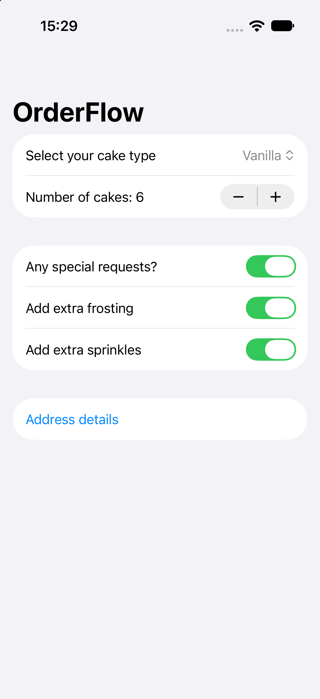
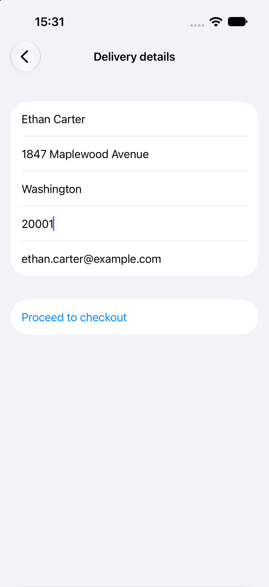
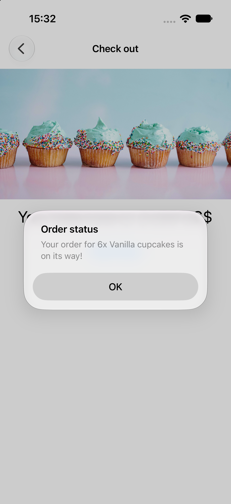
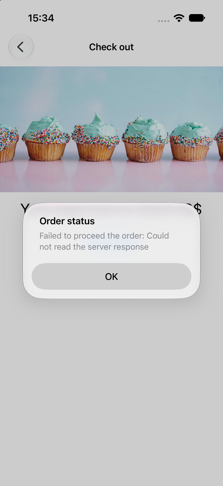

# OrderFlow


A SwiftUI multi-step ordering app for a fictional cupcake shop: configure an order, enter delivery details, review the price and submit the order to a REST API.

> **Note:** This project is based on [100 Days of SwiftUI](https://www.hackingwithswift.com/100/swiftui) by Paul Hudson. The original app and its core idea come from the course. See [Personal changes beyond the course](#personal-changes-beyond-the-course) below for what I changed or added myself.

## Screenshots

| Order | Delivery details | Checkout |
|:---:|:---:|:---:|
|  |  |  |

| Order placed | Order failed |
|:---:|:---:|
|  |  |

## Features

- Configure an order: cupcake type, quantity (3–20) and optional extras (extra frosting, sprinkles)
- Delivery details form with validation; checkout stays disabled until the details are valid
- Delivery details are saved to disk, so repeat orders are faster to complete
- Total price is calculated from type, quantity and extras and shown at checkout
- Order is submitted with a `POST` request to a REST API, with a loading indicator and a success or error alert
- Protection against double submission while a request is in flight
- After a successful order the form resets and navigation returns to the start

## Tech stack

- Swift, SwiftUI
- `URLSession` with async/await, `Codable`
- Observation framework (`@Observable`)
- `NavigationStack` with `NavigationPath`
- Swift Testing (`@Test`, `#expect`), GitHub Actions
- `.xcconfig` files for configuration

## Architecture

Clean Architecture with three layers, wired together in the app entry point (composition root). Dependencies point inwards: `Presentation → Domain ← Data`.

```
OrderFlow/
├── MyApp.swift             Composition root: creates repository, use case and store
├── AppConfig.swift         Reads the API key from Info.plist
├── Domain/
│   ├── Entities/           Order, CupcakeType, DeliveryDetails
│   ├── Repositories/       OrderRepository, DeliveryDetailsStore (protocols)
│   └── UseCases/           PlaceOrderUseCase
├── Data/
│   ├── Network/            OrderRepositoryImpl, OrderDTO, NetworkingErrors
│   ├── Mappers/            OrderMapper (domain <-> DTO)
│   └── Storage/            FileDeliveryDetailsStore (JSON file)
└── Presentation/
    ├── Navigation/         AppCoordinator, Route
    ├── Order/              Order screen + view model
    ├── Address/            Delivery details screen
    └── Checkout/           Checkout screen + view model, OrderPlacementState
```

- **Domain** contains entities, business rules (pricing, address validation) and protocols. It depends only on `Foundation`.
- **Data** implements those protocols: the network repository, the DTO and mapper, and file storage.
- **Presentation** holds views, view models and navigation. View models receive a use case, not a concrete repository, so they can be tested with mocks.
- **`AppCoordinator`** owns the `NavigationPath`; screens ask it to navigate through a typed `Route` enum.

## Testing

Unit tests are written with Swift Testing:

- **Pricing:** base cost per cupcake type, extra frosting, sprinkles, and resetting extras when special requests are turned off
- **Address validation:** empty fields, whitespace-only input, email format, zip length limit
- **Mapping:** domain to DTO, DTO to domain, and a round trip that preserves data
- **Checkout view model** with a mock repository: successful order, server error, and a double tap that must trigger only one request

GitHub Actions builds the project and runs the tests on every push.

## Personal changes beyond the course

- **Clean Architecture** (Domain / Data / Presentation) with protocols for the repository and storage, a use case, and a DTO with a mapper. The course keeps everything in one layer.
- **Coordinator-style navigation:** `AppCoordinator` with `NavigationPath` and a `Route` enum.
- **Typed network errors** (`NetworkingErrors`) and HTTP status validation, with readable messages shown to the user.
- **Order state modelled as an enum** (`idle`, `placing`, `placed`, `failed`) that drives the loading indicator and the alert.
- **Double-submit protection** while an order is being placed, covered by a test.
- **Prices stored as `Decimal`** instead of `Double`.
- **Delivery details persisted behind a protocol** (`DeliveryDetailsStore`) implemented with a JSON file.
- **API key kept out of the repository:** loaded from a git-ignored `Secrets.xcconfig` through `Info.plist`.
- **Unit tests and CI** (see above).

## Requirements

- iOS 17.0+
- Xcode 26 or later

## Running the project

1. Clone the repository
2. Open `OrderFlow.xcodeproj` in Xcode
3. Select an iPhone simulator or device and press Run

The app builds and runs without any setup. Placing an order sends a request to [reqres.in](https://reqres.in), which may require an API key. To use one, create `Config/Secrets.xcconfig` (it is git-ignored) with:

```
REQRES_API_KEY = your_key_here
```

Without a key the request may be rejected by the server; the error is then shown in the alert.

## Credits

Original app concept and tutorial: [Paul Hudson, Hacking with Swift](https://www.hackingwithswift.com).
